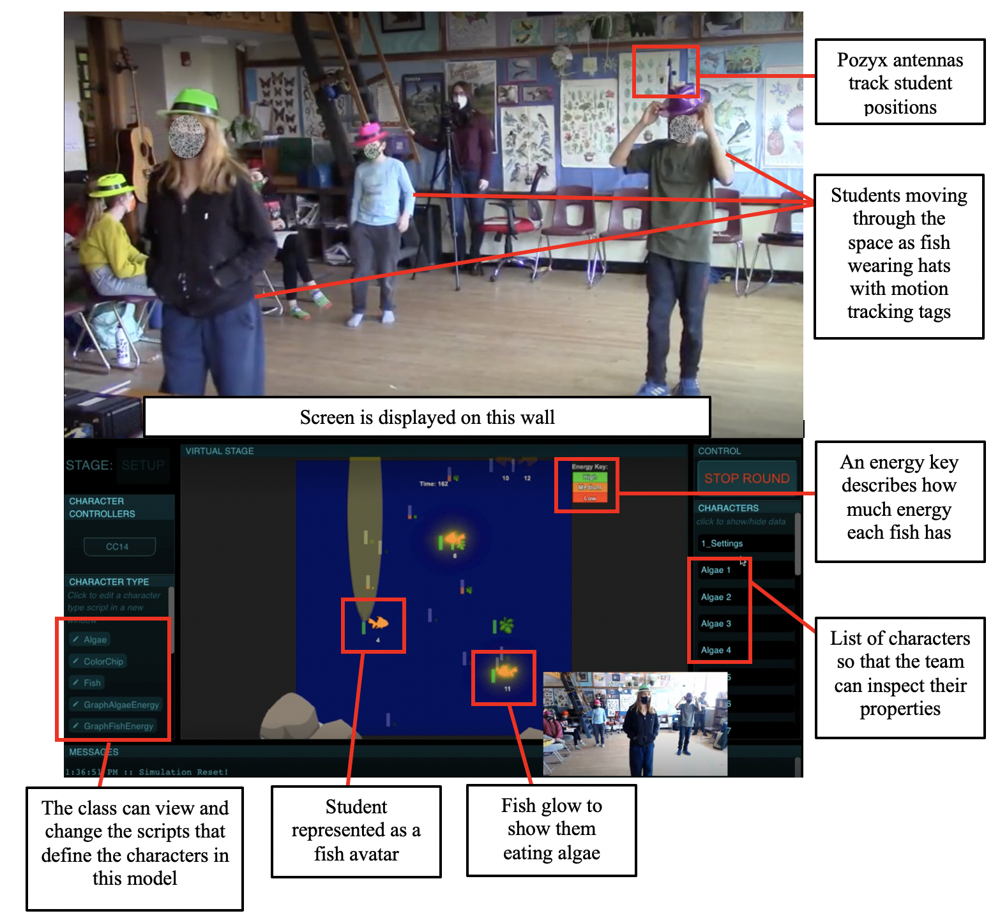

## About STEP 

In the Science through Technology Enhanced Play (STEP) project, we are investigating how embodied play among elementary school students can be used to help them understand scientific phenomena (e.g., the working of forces, complex behaviors of bees).

Below is an image of a recent implementation of our most recent version, GEM-STEP, in action. Here you can see children in the classroom pretending to be fish. As they do this, the GEM-STEP system tracks their locations using tags on their hats and uses that information to control fish in the simulation at the bottom of the image. This simulation is then projected for the students to see as they play. In this activity, the students are exploring how the fish in a pond ecosystem are dependent on the algae for survival, and how the algae are in-turn dependent on the sun. Our theoretical framework for embodied learning <a href="https://doi.org/10.1007/s11412-020-09317-3" target="_blank">(Danish et al., 2020)</a> highlights how youth learn in this kind of activity by attending to both their individual embodied experience of moving around, and their social, collective experience of coordinating their movement as they explore this system.

This video illustrates using the STEP-BEES platform:

<iframe src="https://player.vimeo.com/video/164627313?h=882ac3308e" style="position:absolute;top:0;left:0;width:100%;height:100%;" frameborder="0" allow="autoplay; fullscreen; picture-in-picture" allowfullscreen></iframe>

The STEP Project is the result of a series of grants including:

- **STEP**: Our initial foray into exploring how embodied play can support students in engaging with scientific concepts. We explored different kinds of play (modeling oriented sociodramatic play and more game-like play) as well as exploring two content areas–the particulate nature of matter, and honeybees collecting nectar.  Grant Abstract
- **PLAE**: In the Promoting Learning though Annotation of Embodiment project we added in the ability for other students to use an iPad app and annotate their peers’ activity.  Grant Abstract
- **iSTEP**: In the Interactive STEP project, we added in new forms of embodied engagement including pose tracking and props, so that we can explore their impact on students’ engagement with the activities, and the resulting learning.  Grant Abstract
- **GEM-STEP**: The Generealized Embodied Modelling STEP project aims to support learners of all ages in developing their own hybrid embodied models through a combination of scripting and play. 
- **What's next?**: We are now working with our colleagues on the <a href="https://sites.google.com/ncsu.edu/ai-engage/home" target="_blank">Engage AI Institute</a> to explore how AI can further support students and teachers as they engage in embodied learning.

Note that this work extends our prior work on the Learning Physics through Play (LPP) Project.


